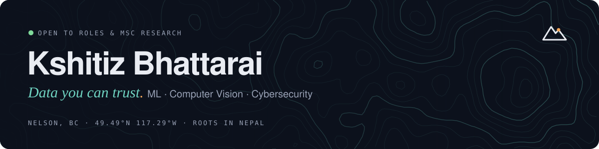

  
  
  

I build systems that turn data into decisions and keep them secure. Over 8+ years I've worked across **software engineering, machine learning, data analytics and IT security**, in Bengaluru, Kathmandu, Toronto and now Nelson, BC.

- **Now:** leading data, automation, cybersecurity and AI work for 50+ staff and ~20,000 customers
- **Research interest:** telling adversarial drift apart from natural change in deployed detectors, plus robust computer vision
- **Open to:** roles in AI, data and cybersecurity across Canada, and MSc research collaborations

### Selected work

| Project | What it does | Stack |
|---|---|---|
| **eKYC Identity Verification** | Face detection, live-selfie-to-ID matching and passport OCR for a fintech product. Contributed to a **40% sales increase**. | Python · Flask · Azure · OpenCV |
| **Fraud & Anomaly Detection** | Flags unusual activity in banking transaction systems for a regulated environment. | Python · Elasticsearch · Docker |
| **AI Support Assistant** | Claude-based assistant grounded in a company knowledge base, with command-tag routing. | Claude API · Python |
| **Smart Home Security** | Raspberry Pi door system with LBPH face recognition, Twilio alerts and remote unlock. | OpenCV · Raspberry Pi · IoT |
| [**ASL Alphabet Recognition**](https://github.com/Kshitiz07/ASL_TransferLearning) | Sign-language alphabet recognizer using transfer learning on InceptionV3. | TensorFlow · OpenCV |
| [**MovieLens Recommender**](https://github.com/Kshitiz07/SocialMediaAnalytics_Assignment_Recommender-System-on-MovieLens-dataset) | Collaborative-filtering recommender built and evaluated on MovieLens. | Python · Jupyter |

The first four were built for employers or as a capstone, so their code is private. Full write-ups and live demos are on my <a href="https://kshitiz07.github.io">portfolio</a>.

### Toolkit

**ML & vision:** TensorFlow · Keras · scikit-learn · OpenCV · NLP · OCR  
**Data:** Python · Pandas · SQL · PostgreSQL · Power BI · ETL · Elastic Stack  
**Cloud & build:** Docker · AWS (Lambda) · Azure · Flask · FastAPI · Django · Zapier · Claude API  
**Security & IT:** Microsoft 365 · Microsoft Defender · DMARC · phishing response · security awareness training

### Background

PG Certificate in AI & Machine Learning, Lambton College (Dean's Honour List) · B.E. Computer Science & Engineering, Dr. Ambedkar Institute of Technology (First Class with Distinction)

Fun fact: I love talking with older people and listening to their stories.
